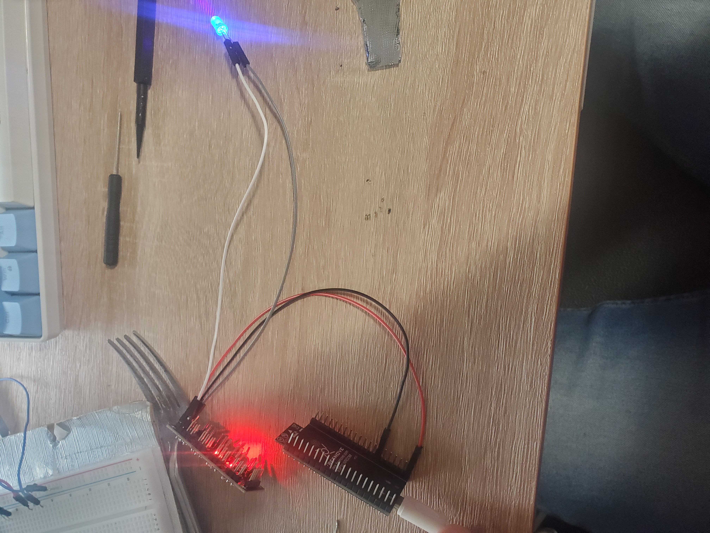
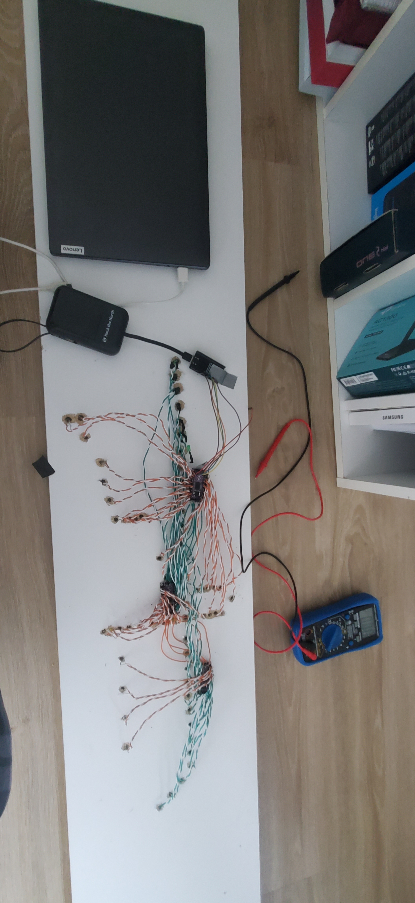
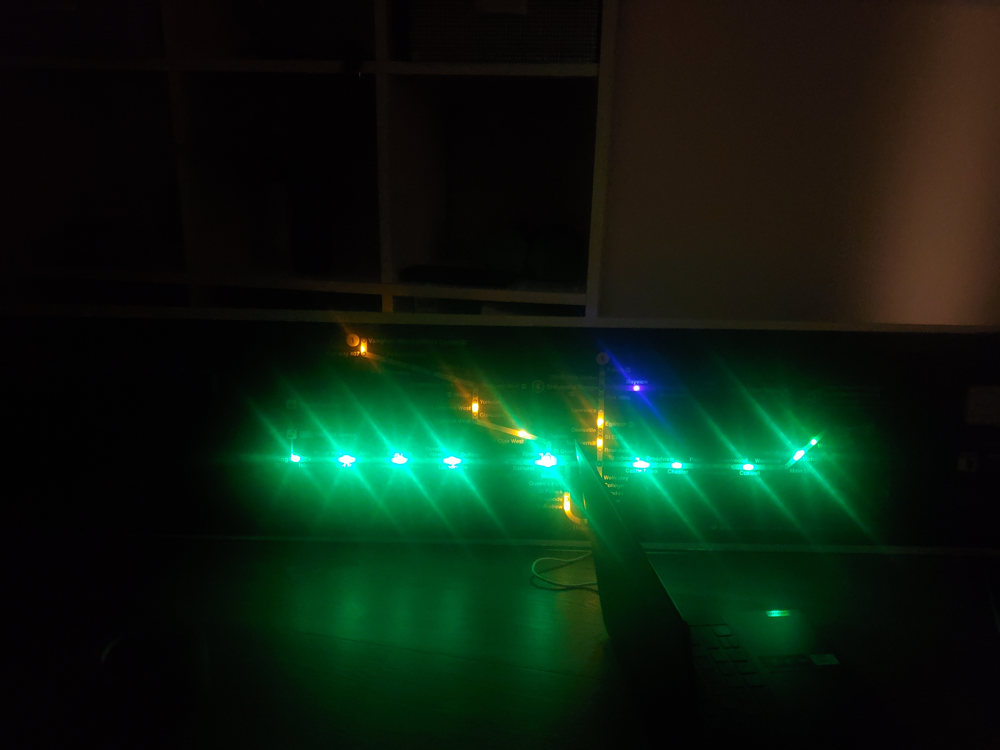

# 🚇 TTC Tracker

A live transit visualization panel that displays real-time subway train positions across Toronto's TTC network using addressable LEDs.

Integrated with TTC’s official **Next Train Arrival System (NTAS)** API, the system runs on an **ESP32 microcontroller**, connects to WiFi, and continuously updates stop-by-stop activity across the **Yellow**, **Green**, and **Purple** subway lines.

## 🔧 Hardware

- **ESP32 Dev Board** (via PlatformIO)
- **3× TLC5947 24-channel LED Drivers**
- **70× 3mm LEDs**
- Authentic **TTC Subway Map** ([TTCShop.ca](https://www.ttcshop.ca))
- Mounting board, wiring, solder tools (KSGER T12), and duct tape

---

## 🌐 Data Source

- TTC API:  
  `https://ntas.ttc.ca/api/ntas/get-next-train-time/{stopid}`

Since TTC’s public API does not cover subways, this endpoint is used for stop-by-stop scraping of live arrival times.

---
## 🧠 How It Works

1. ESP32 connects to WiFi
2. Loops through station stop IDs line by line
3. Makes HTTPS requests to retrieve next train arrival time
4. If a train is arriving in 0–1 minutes, lights up that stop’s LED
5. Updates every 10 seconds

---

## 🛠 Build Process
### 📍 Positioning
Marking drill holes by aligning the TTC map over paper.

  

### Drilling

### 🔌 Prototyping
Testing TLC5947 driver control with ESP32 and single LEDs.

### 🪛 Wiring LEDs
Mounting LEDs behind the board, aligned to subway stop positions.

### ✅ Final Mount
Map mounted and LEDs lit based on real-time TTC data.

  

---

## 🎬 Demo

- Preview video: [`endvideo.mp4`](assets/endvideo.mp4)

---
